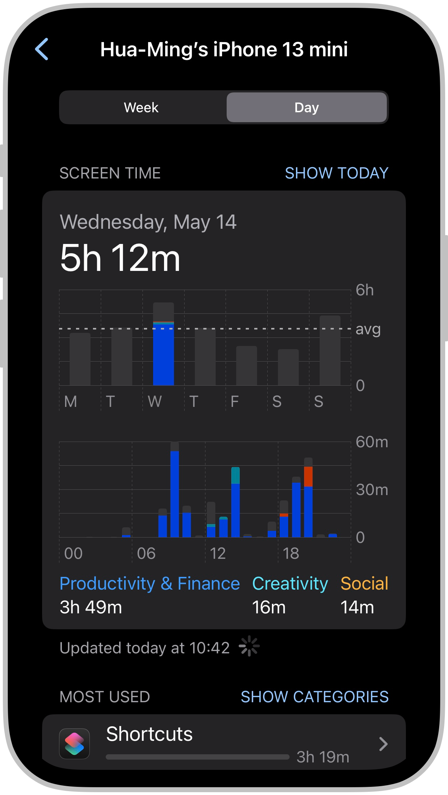
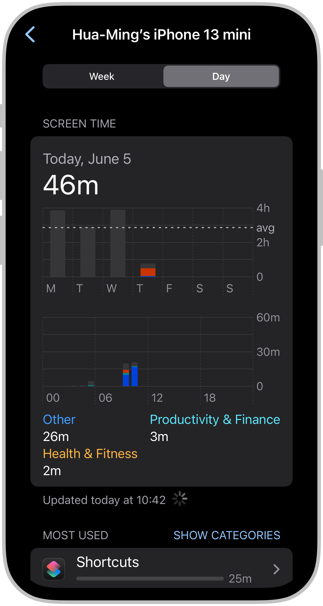

I've been trying to be more mindful about how I spend time on my iPhone.

After discovering the unofficial list of [Apple's Settings URL scheme](https://github.com/FifiTheBulldog/ios-settings-urls/blob/master/settings-urls.md), I created [a collection of shortcuts](https://shortcutomation.com/gallery/iphone-settings) to automate access to specific iPhone settings.

Each night—about an hour before bed—I use [iOS’s personal automation](https://support.apple.com/guide/shortcuts/intro-to-personal-automation-apd690170742/ios) to trigger one of these shortcuts. It sends me a _scheduled, customized_ notification reminding me to review my screen time.[^1]

|  |
| :---: |
| Every night at 20:00, I received a notification to check my daily screen time on the Lock Screen. |

When I tap it, it opens directly to the [**Screen Time Summary**](https://support.apple.com/guide/iphone/get-started-with-screen-time-iphbfa595995) ,[^2] where I can see how I actually spent time with my phone:

* Which apps or websites I used most
* How often I picked up my phone
* What times of day I was most active [^3]

|                                                 |                                        |
| :-------------------------------------------------------------------------------------: | :--------------------------------------------------------------------------: |
| A day of intense focus on building shortcuts left me feeling completely overwhelmed 😣 (but fulfilled 😊).  | For the first time in my entire life, I kept my screen time under 1 hour! 🥳 |

This moment of awareness—by seeing the numbers—has helped me wind down with more intention and adjust my behaviors accordingly.

To set it up:

1. Download the following two shortcuts:
	1. [Check Daily Screen Time](https://www.icloud.com/shortcuts/f68941b5000448128495269faf596bc5)
	2. [Go to Screen Time Summary](https://shortcutomation.com/gallery/iphone-settings/go-to-screen-time-summary/)
2. Install the [Scriptable](https://scriptable.app/) app for the [“Check Daily Screen Time”](https://www.icloud.com/shortcuts/f68941b5000448128495269faf596bc5) shortcut to work properly.
3. Open the Shortcuts app.
4. Navigate to the **Automation** tab at the bottom of the screen.
5. Create a new **Personal Automation**:
	1. Tap the `+` button in the top-right corner.
	2. Choose **Time of Day** (e.g. 9:00 PM).
	3. Tap **Next** to proceed to the actions screen.
	4. Add the **“Run Shortcut”** action.
	5. Select the [“Check Daily Screen Time”](https://www.icloud.com/shortcuts/f68941b5000448128495269faf596bc5) shortcut.

[Time is the most valuable asset on the planet.](https://paulgraham.com/vb.html) In this AI age of abundant information, it's so easy to fall into the endless scroll without even realizing it. Everyone (and everything) is competing for your attention. Your energy flows to where your attention goes. Use it wisely.

We need to become more conscious of our screen time and use our phone with more intention. This aligns with [Shortcutomation](https://shortcutomation.com)'s core mission: helping people take back their time.

It's not about cutting the screen time overnight.

It's about noticing, recognizing patterns, and creating space to pause and think.

Take 30 seconds today to give this ritual a try!

Ask yourself: **“Did I use my phone today in a way I feel good about?”**

And if not—that's okay—you get to try again tomorrow. 🫶

[^1]: You can also [add a Screen Time widget to your Home Screen](https://support.apple.com/guide/iphone/add-edit-and-remove-widgets-iphb8f1bf206/18.0/ios/18.0#iphefb49b7e0). The widget will display information from your [Screen Time summary](https://support.apple.com/guide/iphone/get-started-with-screen-time-iphbfa595995). However, I found it's a distraction for me as it constantly reminds me of how much time I'm spending on my phone, which sometimes makes me feel stressed or guilty instead of motivated to improve.
[^2]: If you want to navigate manually to this page, go to **Settings** \> **Screen Time \> See All App \& Website Activities**.
[^3]: You can also check a _weekly summary_ and see _which apps are sending you the most notifications_.
