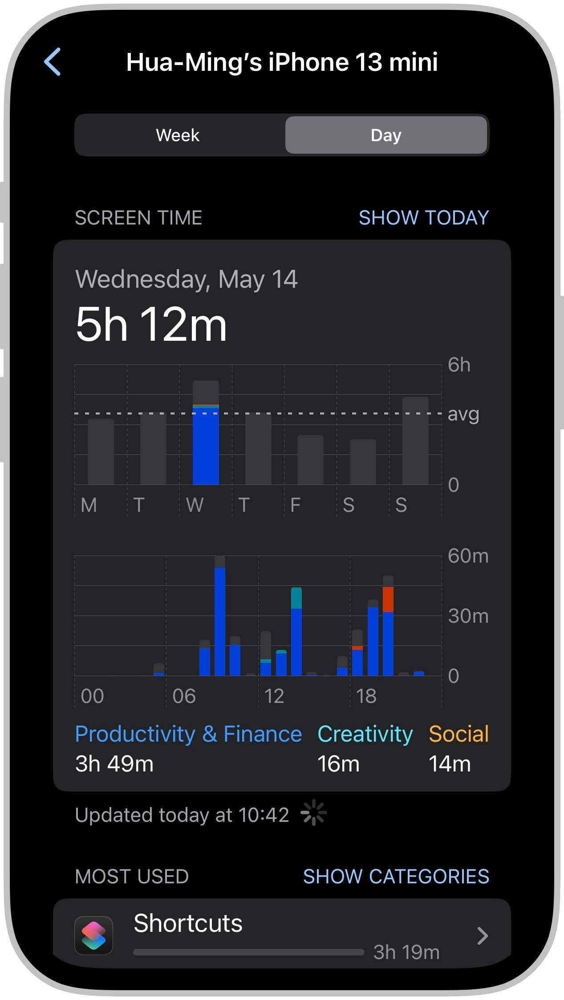
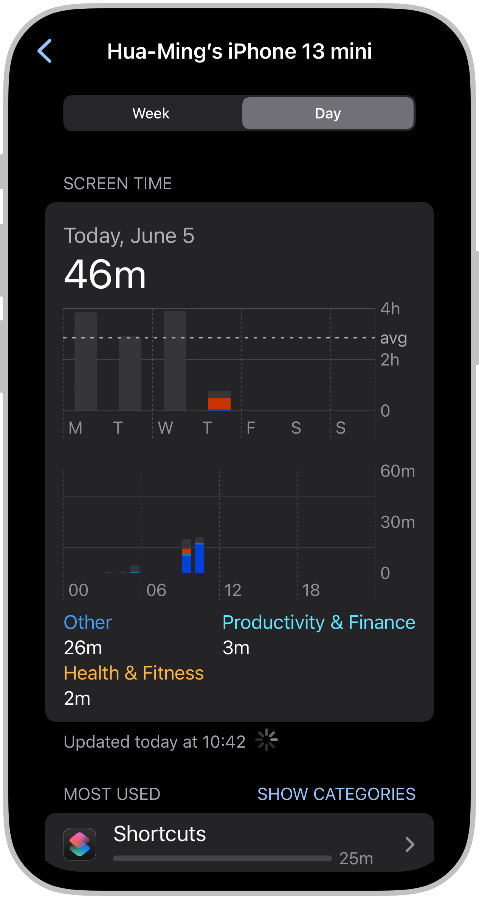

> _“The price of anything is the amount of life you exchange for it.” — Henry David Thoreau_

Over the past 12 months, I've been training myself to become more conscious of my phone use.

After discovering the unofficial list of [Apple's Settings URL schemes](https://github.com/FifiTheBulldog/ios-settings-urls/blob/master/settings-urls.md), I created [a collection of shortcuts](https://shortcutomation.com/gallery/iphone-settings) to automate access to specific iPhone settings.

Each night—about an hour before bed—I use [iOS’s Personal Automation](https://support.apple.com/guide/shortcuts/intro-to-personal-automation-apd690170742/ios) to trigger one of these shortcuts. It sends me a _scheduled, customized_ notification reminding me to review my screen time.[^1]

|                                                                   |
| :-----------------------------------------------------------------------------------------------: |
| Every night at 20:00, I received a notification to check my daily screen time on the Lock Screen. |

When I tap it, it opens directly to the [**Screen Time Summary**](https://support.apple.com/guide/iphone/get-started-with-screen-time-iphbfa595995) ,[^2] where I can reflect on how I spent time with my phone that day:

* Which apps or websites I used most
* How often I picked up my phone
* What times of day I was most active [^3]

|                                                                                 |               |
| :--------------------------------------------------------------------------------------------------------------------------------------------: | :--------------------------------------------------------------------------: |
| A day of intense focus on [building shortcuts](https://shortcutomation.com/gallery) left me feeling completely overwhelmed (but fulfilled 😊). | For the first time in my entire life, I kept my screen time under 1 hour! 🥳 |

That moment of awareness—seeing the actual numbers—has helped me wind down with more intention and adjust my habits accordingly.

Setting this up takes just a few minutes:

1. Download the following two shortcuts:
	1. [Check Daily Screen Time](https://www.icloud.com/shortcuts/f68941b5000448128495269faf596bc5)
	2. [Go to Screen Time Summary](https://shortcutomation.com/gallery/iphone-settings/go-to-screen-time-summary/)
2. Install the [Scriptable app](https://scriptable.app/) for the “Check Daily Screen Time” shortcut to work properly.
3. Open the Shortcuts app.
4. Go to the **Automation** tab at the bottom.
5. Create a new **Personal Automation**:
	1. Tap the `+` button in the top-right corner.
	2. Choose **Time of Day** (e.g. 9:00 PM).
	3. Tap **Next** to proceed.
	4. Add the **“Run Shortcut”** action.
	5. Select the “Check Daily Screen Time” shortcut.

In this age of infinite information, almost everything is competing for your attention. It's never been easier to slip into endless scrolling.

We must be more intentional with our phone use. That's exactly what [Shortcutomation](https://shortcutomation.com/) is all about: **helping people take back their [time—the most valuable asset on the planet.](https://paulgraham.com/vb.html)**

If you do the math, doomscrolling just one hour a day on your phone adds up to 22 full waking days a year—that's 22 straight days spent staring at a screen, time you could reclaim for something more meaningful to build the life you want. [^4]

[As Tony Robbins says](https://youtu.be/b8jS86OtgLA): “_Where focus goes, energy flows._” Every hour you spend scrolling social media, watching random videos, or switching between tasks drains your energy. But when you direct your attention to meaningful goals—whether it's learning a skill, making progress on a project, or building relationships—your energy fuels real growth. Your attention is the new oil. Use it wisely.

This isn't about cutting screen time overnight; it's about noticing, recognizing patterns, and creating space to pause, think, and reflect.

Take just 30 seconds today to try this simple ritual:

Ask yourself: “_Did I use my phone today in a way that feels good to me?_”

Try installing the “Check Daily Screen Time” shortcut and start your journey toward mindful phone use.

[^1]: You can also [add a Screen Time widget to your Home Screen](https://support.apple.com/guide/iphone/add-edit-and-remove-widgets-iphb8f1bf206/18.0/ios/18.0#iphefb49b7e0). The widget will display information from your [Screen Time summary](https://support.apple.com/guide/iphone/get-started-with-screen-time-iphbfa595995). However, I found it's a distraction for me as it constantly reminds me of how much time I'm spending on my phone, which sometimes makes me feel stressed or guilty instead of motivated to improve.
[^2]: If you want to navigate manually to this page, go to **Settings** \> **Screen Time \> See All App \& Website Activities**.
[^3]: You can also check a _weekly summary_ and see _which apps are sending you the most notifications_.
[^4]: I assume 16 waking hours per day instead of 24 because I believe it's a more accurate representation of day-to-day life. Hence the calculation: 365 days × 1 hour/day ÷ 16 waking hours per day ≈ 22 days.
