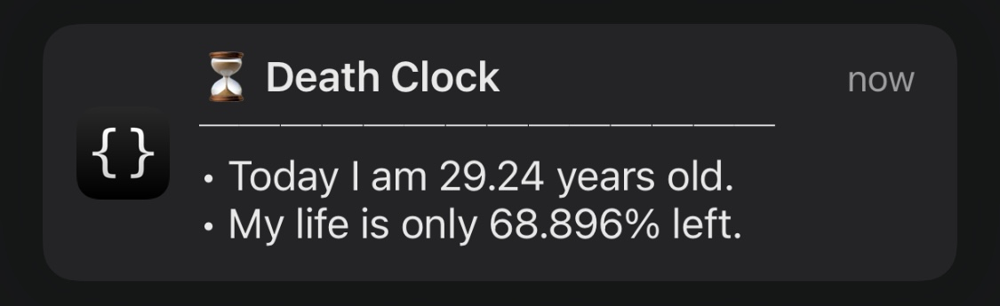

> _“Every man has two lives, and the second starts when he realizes he has just one.” — Confucius_

What if you could visualize, every day, how much of your life has already passed?

Death is scary. It’s uncomfortable to think about—so we tend to avoid it. But when we use death not as something to fear, but as a **frame of reference**, it becomes a powerful tool for clarity.

Ancient wisdom always teaches us life principles and philosophies. They stood the test of time for a reason. I like the Stoic “live as if today were your last” mindset and _Memento Mori_, a Latin phrase that translates to “remember that you must die.”

Death is the ultimate equalizer. Despite our differences in appearance, cultures, and beliefs, we are all going to die. Death is the destination we all share. No one has ever escaped it.

This universal truth inspired me to build a **[Death Clock](https://shortcutomation.com/death-clock)**. It calculates two metrics:

1. How old I am.
2. What percentage of my life is (probably) behind me.

Every morning, my Lock Screen greets me with these numbers, thanks to a [Personal Automation](https://support.apple.com/guide/shortcuts/intro-to-personal-automation-apd690170742/ios).

I used to put off small joys in _this moment, [this pixel](https://waitbutwhy.com/2013/11/life-is-picture-but-you-live-in-pixel.html), this now_—[calling a loved one](https://shortcutomation.com/call-people-i-love/), taking a walk, savoring a meal—thinking there would always be more time later. But _later_ often means _never_. [It’s later than you think.](https://www.youtube.com/watch?v=nFxjnUPRwx4)

The [Death Clock](https://shortcutomation.com/death-clock/) reminds me that every single second I’m dying. It internalizes the certainty of death, rewiring my brain to prioritize what I might [regret on my deathbed](https://bronnieware.com/regrets-of-the-dying/). **It’s not the number that is the most important, but seeing the number changing day after day that makes the difference.**

> _“Almost everything…just fall[s] away in the face of death, leaving only what is truly important…Remembering that you are going to die is the best way I know to avoid the trap of thinking: you have something to lose. You are already naked. There is no reason not to follow your heart.” — Steve Jobs_ [^1]

Paradoxically, it’s only when death waits at the end of the road that the unique meaning of each person’s life can fully emerge. When you embrace the inescapability of death, you know you have nothing to lose and stop worrying what other people think about you. Life becomes less about proving yourself and more about giving away your gift to something greater than you. You view life as a service.

[Mitch Albom](https://www.google.com/search?q=Mitch+Albom) once said in _[Tuesdays With Morrie](https://www.google.com/search?q=Tuesdays+With+Morrie)_:

> _The truth is, once you learn how to die, you learn how to live._

I believe that _learning how to die_ means being prepared for it—knowing that it’s inevitably coming. Once you accept that death is not the opposite of life, but rather an essential part of it, you begin to notice and appreciate the little small things in your day, welcoming whatever comes your way.

So, live each day as if it were your last, because someday you’ll certainly be right. Every time you do something that is one less time you could do it. Cherish every moment of your life like it is your last, because it very likely might be. Every single thing you do today is something your ninety-year-old self will wish they could come back and do. The good old days are happening right now.

Make the rest of your life the best of your life. Don’t live the same year 75 times and call it a life. Don’t be a “Living Dead.” Never _die_ before you are _dead_.

One day, your life will flash before your eyes. Make sure it’s worth watching.

In the end, it’s not the years in your life that count. It’s the life in your years.

[Make each day count.](https://youtu.be/JYdCltjvrxg)

[^1]: Watch [Steve Jobs’ legendary 2005 Stanford Commencement Address on death](https://youtu.be/UF8uR6Z6KLc?t=544) (and the full speech). Highly recommended.
