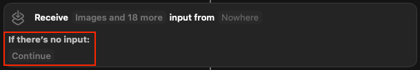
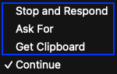
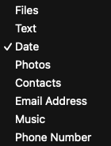

By default, Shortcuts proceeds _if no input is provided_—but did you know you can change this behavior?

Tap the “Continue” bubble, you will see the following three options:

1. **Stop and Respond**

	* Immediately ends the shortcut and optionally shows a custom message. [^1]
	* Ideal for explicit error handling.

2. **Ask For**

	

	* Prompts the user to enter or pick a value of the specific type.
	* ⭐️ This is my favorite choice for shortcuts that require input. For example:
		1. Ask For “Text” in the [“❝ Capture Quotes”](https://shortcutomation.com/capture-quotes/) shortcut
		2. Ask For “Date” in the [“✏️ Create New Journal”](https://shortcutomation.com/create-new-journal/) shortcut
	* If you prefer **Continue**, add an **If Shortcut Input doesn’t have any value** block at the start to deal with missing input. However, using **Ask For** removes this extra step—see the [“Reverse Image Search”](https://shortcutomation.com/reverse-image-search/) example.

3. **Get Clipboard**

	* Uses the current clipboard content as input.
	* Useful when users need to pre-copy text before running the shortcut.

By selecting the right input option, your shortcuts become intuitive, user-friendly, and able to manage [edge cases](https://en.wikipedia.org/wiki/Edge_case) more effectively.

[^1]: Leave the “Response” field empty if you don’t want to display anything.
