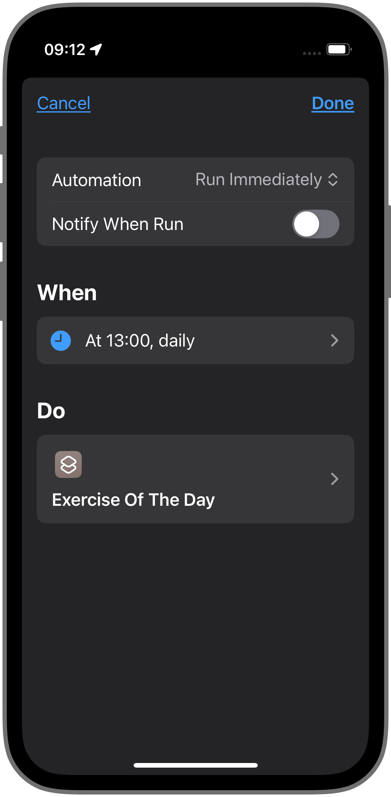
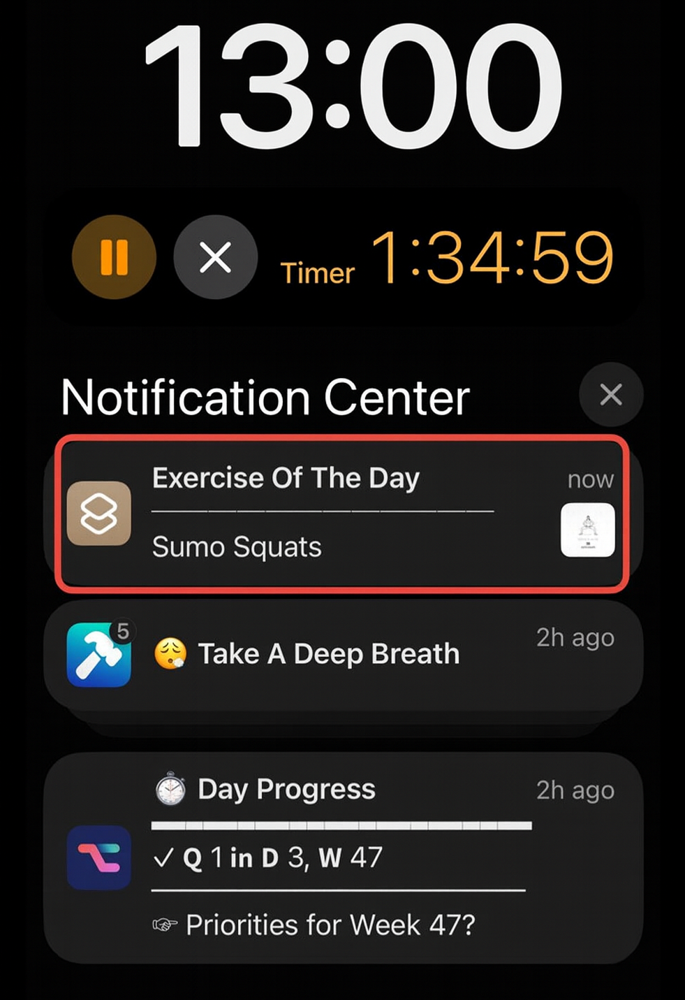
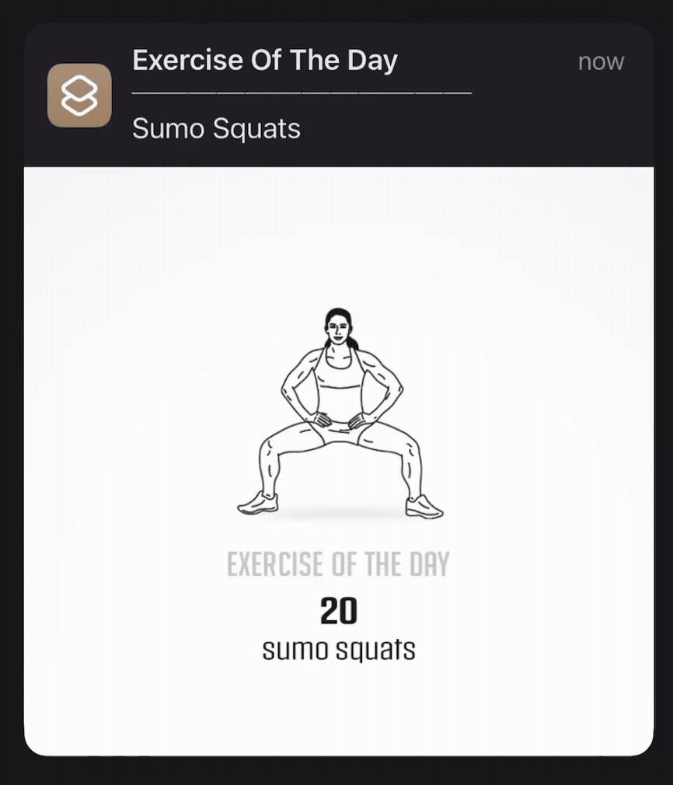

> _“My number one priority in life, above my happiness, above my family, above my work, is my own health. It starts with my physical health. Because my physical health became my number one priority, then I could never say I don’t have time. […] I do not start my day until I’ve worked out. I don’t care if the world is imploding and melting down, it can wait another 30 minutes until I’m done working out.” — Naval Ravikant_

We all know we should exercise more. But often, the barrier to entry is just too high. We think we need to change into gym clothes, drive somewhere, and carve out an entire hour.

But what if the goal wasn’t a “workout”? What if the goal was just **one minute**?

For years, I fell into the “all or nothing” trap. If I couldn’t do a full long workout session, I would do nothing at all.

I used to struggle with consistency until I automated my fitness using a simple Apple Shortcut.

Here is how I used technology to build a [daily exercise habit](https://www.strava.com/athletes/huaminghuang) that actually sticks.

# The Science of “Exercise Snacking”

First, let’s address the biggest question: is one minute of exercise really enough?

Science says yes.

A [2022 review](https://doi.org/10.1249/JES.0000000000000275) highlights that performing short, intense bursts of vigorous exercise (≤1 min) throughout the day is a feasible and time-efficient way to improve cardiorespiratory fitness and offset the negative effects of sedentary behavior.

This is called **“[Exercise Snacking](https://www.google.com/search?q=Exercise+Snacking).”**

By shrinking the commitment to 60 seconds, you aren’t “going to the gym”; you’re just doing 20 squats while your coffee brews.

# The “Atomic” Approach

The science proves it works for your _body_, but how to make it work for your _brain_?

In the book _[Atomic Habits](https://jamesclear.com/atomic-habits)_, James Clear argues that the biggest barrier to a new habit isn’t ability—it’s **friction**.

He introduces “[The Law of Least Effort](https://www.goodreads.com/quotes/11868388-human-behavior-follows-the-law-of-least-effort-we-will),” which states that human behavior naturally gravitates toward the option that requires the least amount of work.

This is the principle my automated system is built upon: making the habit so easy that it’s harder to avoid than to do.

# The Setup

Now that we’ve covered the _why_, let’s get into the _how_.

My system relies on content from **[Darebee](https://darebee.com)**, a crowd-funded, non-profit organization that [envisions to make fitness accessible for everyone](https://darebee.com/about.html). [^1]

On their homepage, you’ll find an “Exercise of the Day”—a single, equipment-free movement you can do anywhere.

However, manually visiting a website every day creates friction. The key is to automate the delivery of this exercise, so that I don’t have to remember to do it at all.

Here’s my setup:

1. I configured a Personal Automation in the Shortcuts app to trigger my custom “[Exercise Of The Day](https://shortcutomation.com/gallery/shared/exercise-of-the-day/)” shortcut daily at 1:00 PM—the specific time I [hit my post-lunch slump](https://huami.ng/2025/07/30/a-midday-routine-i-do-every-day/) and need to wake my body up.

	

2. Each day at 1:00 PM sharp, my phone buzzes. I don’t even have to unlock it. The notification appears right on my Lock Screen, telling me exactly what the “snack” is. [^2]

	

3. Here is the most important part. I don’t need to open a browser or an app. **I simply long-press the notification.** Upon expansion, the notification presents a GIF of the exercise with the target rep count, making the full exercise immediately accessible.

	

This setup works because it respects my laziness; on days I have zero energy, I can still do 20 squats.

By combining the biological benefit of “Exercise Snacking” with the psychological strategy of “Lowering the Bar,” I removed any excuse to say “no.”

As [James Clear says,](https://x.com/JamesClear/status/1054799443768287232) “A habit must be established before it can be improved.”

If you’re struggling to build a fitness habit, the problem isn’t a lack of discipline—it’s your system.

Stop trying to climb a mountain. Instead, build a ramp, one small action at a time.

Start small. Master the art of showing up. Optimize later.

Start with a single notification. Give it one minute. You’ll be amazed how far that tiny first step can take you.

[^1]: Darebee is an incredible free resource run by a small team. If you find their work valuable, please consider [donating](https://darebee.com/donate.html) to support them.
[^2]: This is the [“Cue”](https://jamesclear.com/three-steps-habit-change) that James Clear talks about: the obvious trigger that initiates a behavior.
