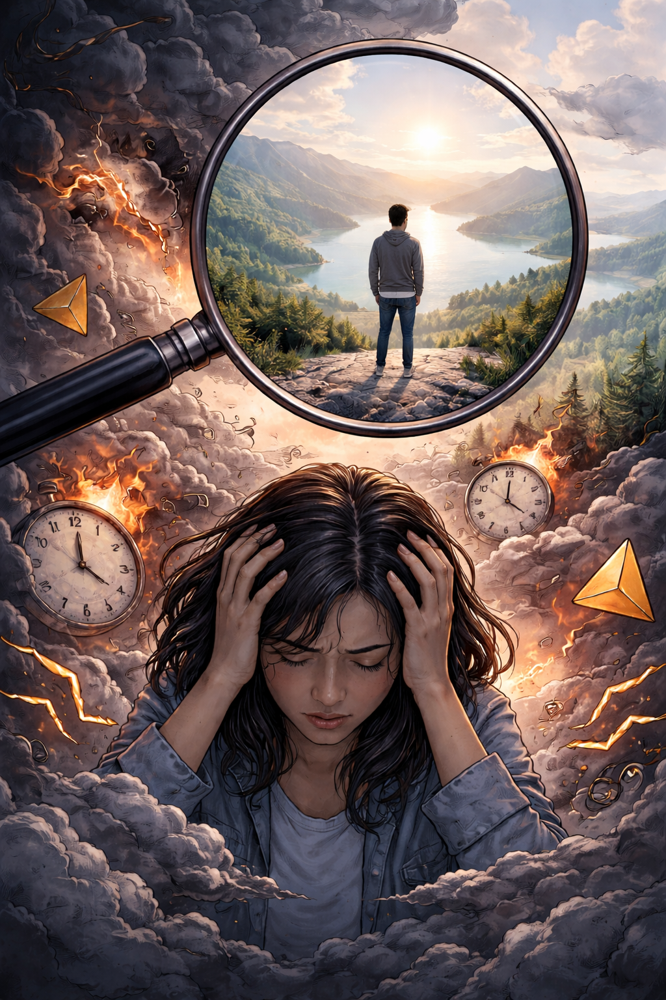
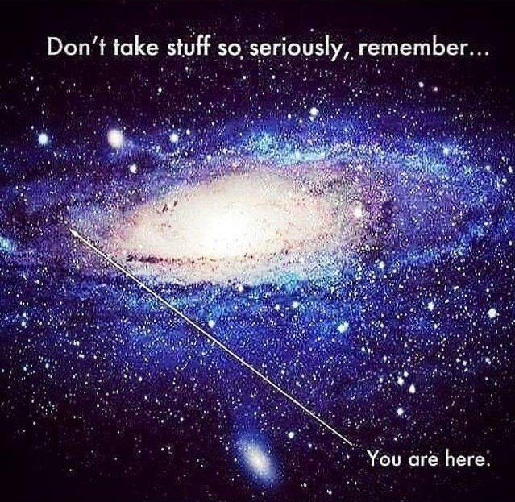

For years, my internal monologue was a harsh taskmaster. I was suffering from the high pressure I put on myself, the weight of my own relentless expectations.

I was obsessed with productivity, efficiency, and squeezing value out of every single second. I convinced myself that if I wasn’t “shipping,” I wasn’t worthy. This mindset spiraled into severe anxiety and a toxic loop of negative self-talk. I was running a race with no finish line.

I was stuck.

The harder I pushed, the more paralyzed I became.

That’s when I realized: to heal, I didn’t need to speed up. I needed to do the exact opposite. I needed to slow down.

# The Power of Zooming Out

When we are anxious, we react impulsively to immediate stressors. We lose perspective.

By slowing down and creating “[psychological distance](https://www.google.com/search?q=psychological+distance)” from our problems, we regain the ability to assess the macro situation.

[Naval Ravikant](https://www.google.com/search?q=Naval+Ravikant) [once said](https://www.youtube.com/shorts/K1IG_aMmi2k):

> _I do believe that 99% of effort in life is ‘wasted’. If you look back at all the term papers you wrote, all the classes you took, all the people you dated, and all the things you stressed about. 99% of them didn’t matter; they were inconsequential; and there were a few 1% decisions that did matter._

When you’re deep in anxiety, every choice feels like black or white. But when you zoom out, you see that most things make no difference.

# The Overview Effect

There is no greater example of “zooming out” than what astronauts call **[The Overview Effect](https://en.wikipedia.org/wiki/Overview_effect)**.

When astronauts view Earth from space, many describe a profound cognitive shift: our planet appears as a fragile blue marble in darkness. Borders disappear, divisions dissolve, and the conflicts that once felt enormous shrink to near insignificance.

As the legendary astronomer [Carl Sagan](https://www.google.com/search?q=Carl+Sagan) famously said in his 1994 _[Pale Blue Dot](https://huami.ng/pale-blue-dot)_ reflection, our planet is just a “mote of dust suspended in a sunbeam.”

Step back far enough, and your toughest struggles stop feeling so big. What once felt overwhelming suddenly feels manageable.

# The Apple Shortcut

I wanted a way to trigger this “Overview Effect” right from my phone.

So, I built an [Apple Shortcut](https://shortcutomation.com/nasa-epic-gif).

It connects to the **[NASA EPIC (Earth Polychromatic Imaging Camera) API](https://epic.gsfc.nasa.gov/about/api)** to fetch the latest satellite images of Earth. The Shortcut stitches these photos together, turning them into an animated GIF of our beautiful planet in motion.

I also added a message that appears with the notification:

> “你很棒，放輕鬆，別太逼自己了。” [^1]
>
> _You are enough. Relax. Don’t push yourself too hard._

Thanks to [Personal Automation](https://support.apple.com/guide/shortcuts/intro-to-personal-automation-apd690170742/ios), each night before bed, the Shortcut presents me with the ultimate bird’s-eye view: The entire Earth, spinning silently in the dark.

It’s a visual reminder that 99% of what I’m stressing about is tiny compared with the scale of the Earth.

# The Most Important Conversation in Life

The Shortcut is just a tool. The real work happens in the conversation you have with yourself when the notification pops up.

[As David Goggins said](https://www.facebook.com/watch/?v=243100336350252):

> _The most important conversations you’ll ever have are the ones you’ll have with yourself._

The voice in your head is your permanent roommate. You wake up with it, carry it through the day, and go to bed with it. Eventually, you live out what it says, good or bad.

For too long, my inner dialogue was unforgiving. But I’ve learned the hard way that negative self-talk is the enemy of progress. We are often our own biggest critics; no one else will ever be as brutal to you as you are to yourself.

We need to replace self-criticism with self-compassion. British philosopher [Alan Watts](https://www.google.com/search?q=Alan+Watts) captured this balance perfectly:

> _I am always sincere, but never serious._

To be sincere is to act with your whole heart; to be serious is to treat every outcome like a life-or-death crisis. When we lose that “seriousness,” we stop being paralyzed by the fear of failure.

Psychologists have found that referring to yourself in the third person—using your own name instead of “I”—creates immediate mental distance. This practice, known as [distanced self-talk](https://www.google.com/search?q=distanced+self-talk), is a powerful hack for emotion regulation. It allows us to rise above the emotional storm and offer ourselves the kindness we’d offer a friend.

So, the next time you catch yourself criticizing for not being great—pause.

Ask yourself: Can I be okay with being good enough? Can I celebrate the small wins instead?

Can I be, as Alan Watts suggested, “_always sincere, but never serious_”?

If you think you have it tough, look at your life from 100,000 miles away.

When in doubt, zoom out.

[^1]: I borrowed this quote from one of my favorite Taiwanese creators, [Shosho Chang (張修修)](https://shosho.tw/).
